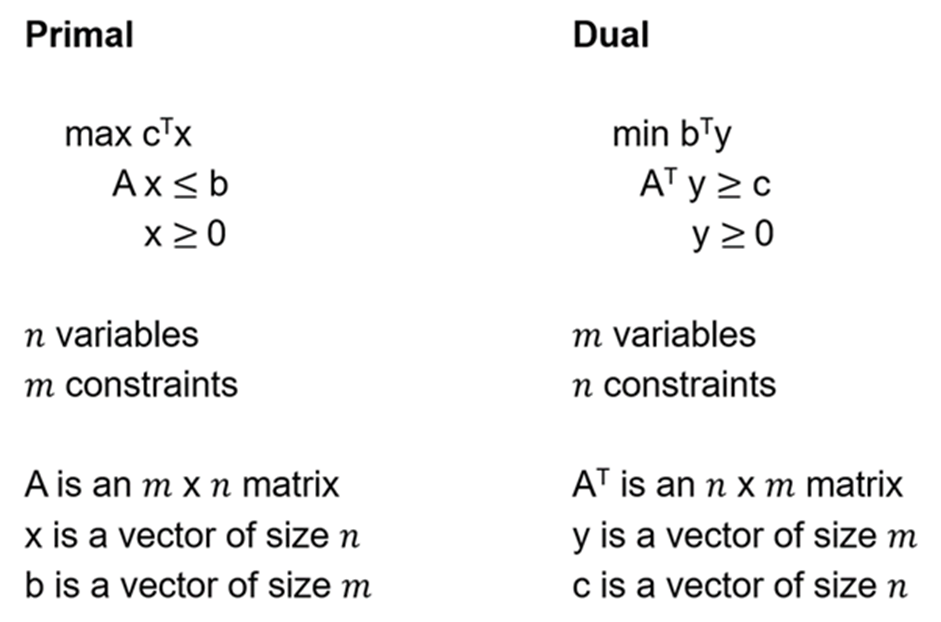
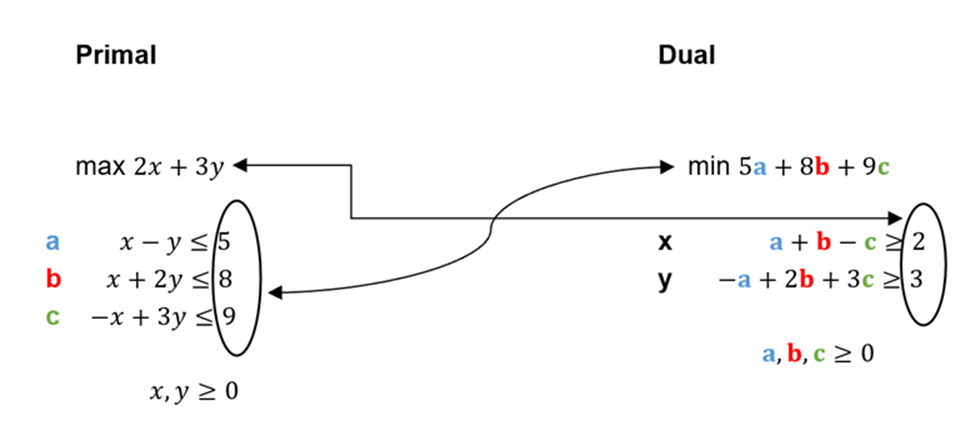
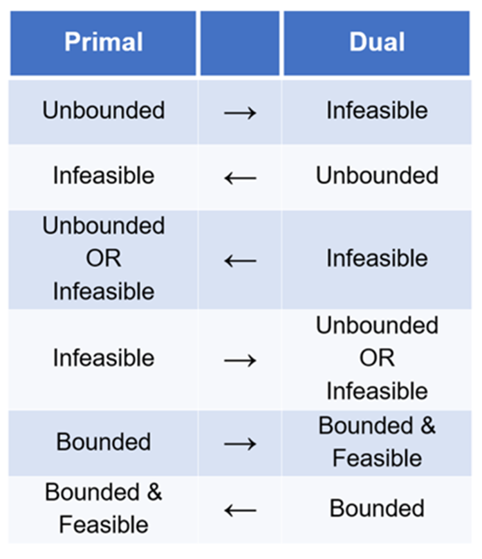

## Linear Programming Guidance

### Format of a Linear Program

A complete linear program (LP) has three components:

1. **Objective function:** Maximizes or minimizes a linear equation.
2. **Constraints:** A set of linear inequalities or equations that must be satisfied.
3. **Non-negativity constraints:** Each variable must be non-negative.

**Example:**

**Objective Function:**

		max 2x + 3y

**Constraints:**

		x - y ≤ 5
		x + 2y ≤ 8
		-x + 3y ≤ 9

**Non-Negativity Constraints:**

		x, y ≥ 0

---

### Standard (Canonical) Form

	

We use the lecture's definition of 'standard form' (also called 'canonical form'):

- The objective function maximizes a linear equation.
- All constraints are upper bounds (≤).
- Each constraint has the expression on the left, constant on the right.
- All variables are subject to non-negativity constraints.

---

### Matrix-Vector Format

LP3, Video 6 describes the 'general form' of an LP problem. To apply the dual LP formulation, the primal LP must be in standard form.

---

### Converting Between Primal & Dual

	

To convert from the primal to the dual LP (using matrix-vector format):

- The vertical coefficients from the primal become horizontal in the dual, and vice versa.
- Follow the method shown in lectures and notes for systematic conversion.

---

### Feasibility and Boundedness

  

**Feasibility:**
- A linear program (LP) is feasible if a solution exists (could be one or infinitely many).
- An LP is either feasible or not—there is no in-between.

**Boundedness:**
- An LP is bounded if there is a limit on how much the objective function can be maximized or minimized.
- Boundedness only makes sense for feasible LPs.

**Key relationships between primal and dual LPs:**
- If the original (primal) LP is unbounded, the dual LP is infeasible.
- If the primal LP is feasible and bounded, the dual LP is also feasible and bounded.
- Both the primal and dual can be infeasible.
- The dual of the dual LP is the primal LP.

These relationships can often be reasoned about using contrapositives. For example, if the dual LP is feasible, then the primal LP must be bounded.

---

### Summary & Tips

- Always write LPs in standard (canonical) form for this course.
- Understand how to convert between primal and dual using matrix-vector notation.
- Know the relationships between feasibility and boundedness for primal and dual LPs.
- Refer to lecture notes and the images above for visual summaries of these concepts.