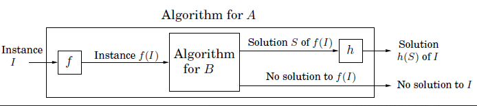

## NP-Complete Proof Guidance

## NP-Complete Proof Guidance

### Context

	

To show an unknown problem **B** is NP-Complete, you must:

1. **Show B is in NP:**
	 - Given an instance of B and a candidate solution, show you can verify the solution in polynomial time (not solve, just check validity).
	 - **Formally:** For instance $I$ and solution $S$, you can verify $S$ is a solution to $I$ in polynomial time (with respect to $|I|$).
	 - **Warning:** If the problem has a goal ($g$), target ($k$), or budget ($b$), your verification must not depend on these values (avoid pseudo-polynomial verification).

2. **Show B is at least as hard as a known NP-Complete problem (A):**
	 - Do this by reducing a known NP-Complete problem **A** to **B** ($A \rightarrow B$).

---

### Required Sections for Your Proof

**(a) Prove B is in NP**
	- Describe, in words, how to verify a candidate solution for B.
	- Provide a runtime analysis in Big-O notation.

**(b) Reduction from A to B ($A \rightarrow B$)**
	- **Input transformation:** Show how any instance of A is converted to an instance of B in polynomial time (function $f$).
	- **Output transformation:** Show how a solution to B is converted to a solution for A in polynomial time (function $h$). Detail this step, even if the output from B is already a solution for A.
	- **Correctness proof:** Prove that a solution for B exists if and only if (IFF) a solution for A exists. You must prove both directions (see below).
	- Provide runtime analyses for both transformations in Big-O notation.

**(c) Demonstrate B IFF A (If-and-Only-If Proof)**
	- Prove: "B has a solution if and only if A has a solution."
	- This means proving both directions:
		- If B has a solution, then A has a solution.
		- If A has a solution, then B has a solution.
	- You may use contrapositives if easier (see below).

---

### If-and-Only-If (IFF) Proofs & Logic

In logic, "A IFF B" means:

		(A ⇒ B) AND (B ⇒ A)

For NP-Completeness, you must prove:

		B has a solution ⇔ A has a solution

You can prove this using any one of the following pairs of implications (choose ONE):

| Option | Implications to Prove |
|--------|----------------------|
| 1      | If B has a solution ⇒ A has a solution If A has a solution ⇒ B has a solution |
| 2      | If B has a solution ⇒ A has a solution If B has NO solution ⇒ A has NO solution |
| 3      | If A has NO solution ⇒ B has NO solution If A has a solution ⇒ B has a solution |
| 4      | If A has NO solution ⇒ B has NO solution If B has NO solution ⇒ A has NO solution |

**You only need to prove one of these combinations.**

#### Contrapositive Logic

Sometimes, proving the contrapositive is easier. For example, instead of proving "if B has a solution then A has a solution," you can prove "if A has NO solution then B has NO solution." These are logically equivalent. Do not prove both a statement and its contrapositive—this is redundant.

---

### Example Format

1. **Prove B is in NP:**
		- Describe how to verify a solution and analyze runtime.
2. **Reduction A → B:**
		- Input transformation (with runtime analysis)
		- Output transformation (with runtime analysis)
		- Correctness proof (B IFF A)

---

### Tips, Mistakes, and Course Rules

- Always reduce from a **known NP-Complete problem (A) to the unknown (B)**. Reducing the wrong way is a major error and will result in a large penalty.
- Pick a known problem that closely resembles the unknown problem.
- If a specific problem is required for the reduction, you must use it.
- You do **not** need to know the details or runtime of the known problem—just its input, output, and what causes it to return NO.
- Treat the unknown problem as a black box—do not design a solution for it.
- Minimize transformations; if you need a lot, you may have chosen the wrong problem.
- Include independent runtime analyses for the NP proof, input transformation, and output transformation. You are not being assessed on optimality, but on correctness and completeness in polynomial time.
- Do **not** depend on $g$, $k$, or $b$ for your runtime.
- Keep instances of A and B straight in your proof.
- Do not place arbitrary limits on the instance of the known problem—your reduction should work for any valid instance of A.
- Only use allowed starting problems (see below).
- Algorithms and black boxes from prior sections of the course are available for use. Black boxes for graphs remain unmodifiable.

---

### Allowed Starting Problems for Reductions

For this course, you may only reduce from one of the following known NP-Complete problems:

- SAT
- 3SAT
- Clique
- Independent Set (IS)
- Vertex Cover (VC)
- Subset Sum (SSS)
- Rudrata Path
- Rudrata (s, t)-Path
- Rudrata Cycle
- Integer Linear Programming (ILP)
- Zero-One Equations (ZOE)
- 3D Matching
- Traveling Salesman Problem (TSP)

Any other problems—including a fan favorite Super Mario Brothers—are not accepted.

---

### Additional Resources

- [3SAT Example Proof (PDF)](3SAT.pdf)
- [P vs NP Primer Video](https://www.youtube.com/watch?v=YX40hbAHx3s)

We will release additional examples as solutions to the assigned practice problems in the coming weeks.
