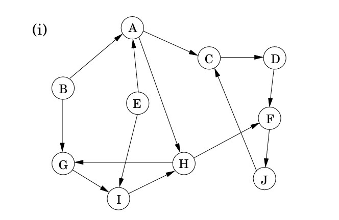
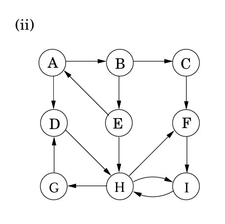

## Practice Problems

### [DPV] Problem 3.3 (Topological ordering example)
Given graph the below graph. Perform DFS with pre and post order number. Whenever there's a need to select what vertex to explore, choose in alphabetical order.
```
A --> C ---> D --> F ---> G
      ^  |         ^  |    
      |  |         |  |    
B -----  --> E -----  --> H
```

a. Whats the pre and post order number?

b. What are the sources and sinks of the graph?

c. What is the topological ordering found by the algorithm?

d. How many topological ordering are there in this graph?

#### Solution
a. 
```
A (1,14) --> C (2,13) ---> D (3,10) --> F (4,9) ---> G (5,6)
             ^         |                ^        |    
             |         |                |        |    
B (15,16) ----         --> E (11,12) ----        --> H (7,8)
```

b. Sources: A, B. Sinks: G, H.

c. Sorted by post-order number decreasing: B, A, C, E, D, F, H, G.

d. 8 valid topological orderings. Since (A,B), (D,E), (G,H) can interchange their internal positions -> 2^3 options.

### [DPV] Problem 3.4 (SCC algorithm example)
Run SSC for each of the below graph following alphabetical order, answer the following questions:

a. In what order are SCCs found?

b. What are the source and sink SCCs?

c. Draw the meta-graph of SCCs.

d. What is the minimum number of edges to make it strongly connected?





#### Solution

##### Graph (i)
```
Run SSC:
Step 1: DFS on reverse graph G'.
A (1,6) -> B (2,3)
           E (4,5)
C (7,20) -> J (8,19) -> F (9,18) -> D (10,11)
                                 -> H (12,17) -> I (13,16) -> G (14,15)
Step 2: Sort by post-order number decreasing on the DFS ordering above.
C J F H I G D A E B
-> Largest post order number is source
-> Sources in reversed graph must be sinks in orignal graph

Step 3: DFS on the original graph on first vertex in the above list that havent had a SCC assigned -> identify a new SCC.

a.
SSC 1 = {C, D, F, J}
SSC 2 = {H, G, I}
SSC 3 = {A}
SSC 4 = {E}
SSC 5 = {B}

b. 
Sources: {B}, {E}
Sinks: {C, D, F, J}

c. Meta graph:

d. 2 edges: (E,B), (C,E) ## NOTE: n_e extra = max(sources, sinks)
```
##### Graph (ii)

```
Run SSC:
Step 1: DFS on reverse graph G'.
A (1,6) -> E (2,5) -> B (3,4)
C (7,8) 
D (9,18) -> G (10,17) -> H (11,16) -> I (12,15) -> F (13,14)

Step 2: Sort by post-order number decreasing on the DFS ordering above.
D G H I F C A E B
-> Largest post order number is source
-> Sources in reversed graph must be sinks in orignal graph

Step 3: DFS on the original graph on first vertex in the above list that havent had a SCC assigned -> identify a new SCC.

a.
SSC 1 = {D, H, F, I, G}
SSC 2 = {C}
SSC 3 = {A, B, E}

b. 
Sources: ABE
Sinks: DFGHI

c. Meta graph:
ABE -> C -> DFGHI
 |            ^
 |            |
 --------------

d. 1 edge: (D,A)
```


### [DPV] Problem 3.5 (Reverse of graph)

Given a directed graph G=(V,E). The reversed graph G_R = (V,E_R) is a graph of the same vertices but with all edges reversed, i.e. E_R = {(v,u): (u,v) \in E}. Find a linear time algorithm for computing the reversed graph in adjacency list format.

#### Solution

a. The algorithm:
Initialize the adjacency of the G_R to be empty list at all vertices.
For each vertex u, iterate through each of its neighbor v in the original graph G, add u into the list of neighbor of v in the reversed graph G_R

b. Justification of Correctness:
Proved by construction by iterating through each edge (u,v) in G and add edge (v,u) in the reversed graph G_R.

c. Runtime analysis:
We iterate through each vertex and each edge once. Hence O(n+m).


### [DPV] Problem 3.15 (Computopia)
All streets in Computopia is one-way. The mayor claims that there is a way to drive legally from any intersection to any other intersection in the city. There is a linear time algorithm to verify that.

a. Formulate the problem in graph theoretically, and explain why it can be solved in linear time.

b. It turns out the mayor is wrong. The next weaker claim is that if you drive from the townhall to any intersection, there is always a legal way to drive back to the townhall. Formulate this in graph theoretically, and show how it too can be checked in linear time.

#### Solution
a. Model each intersecction as a vertex in a graph G=(E,V), and a directed edge between 2 vertices representing a one-way street between 2 intersections.

In graph theory, the mayor's claim is equivalent to checking if the graph is strongly connected, meaning there is a path between any 2 vertices in a directed graph. This can be done with a linear time algorithm such as Kosaraju or Tarjan.

b. The weaker claim means that the townhall belongs to 1 strongly connected component in which there is some path between any 2 vertices, in which there exist 1 path between 2 vertices that go through the townhall.

This can be checked using the below algorithm:
Let vertex s represent the townhall.
Run DFS on G starting from s to discover all intersections reachable from s. Call this set from_s.
Construct graph G_R=(V,E_R) as the reversed graph of G. Run DFS on G_R starting from to discover all intersections that can reach s. Call this set to_s.
If from_s is a subset of to_s, we proved the claim.

Justification of correctness:
DFS on G starting from s gives all the intersections reachable from s. DFS on G_R starting from s gives all the intersections that can reach s. from_s being a subset of to_s means that all intersections reachable from s can also reach s. Hence, it is equivalent to the claim.

Runtime complexity:
DFS: O(n+m)
Hence the algorithm has O(n+m) compelexity.

## Graded Problem

Let G=(V,E) be a directed graph. A vertex v is well connected if for every vertex w in the graph, there is a path from v to w, or there is a path from w to v (both may exist, but at least one must be present).

Design an algorithm that returns a well connected vertex, if such a vertex exists, and returns no otherwise.

### Solution

a. The algorithm:


b. Justification of Correctness:


c. Runtime analysis:

